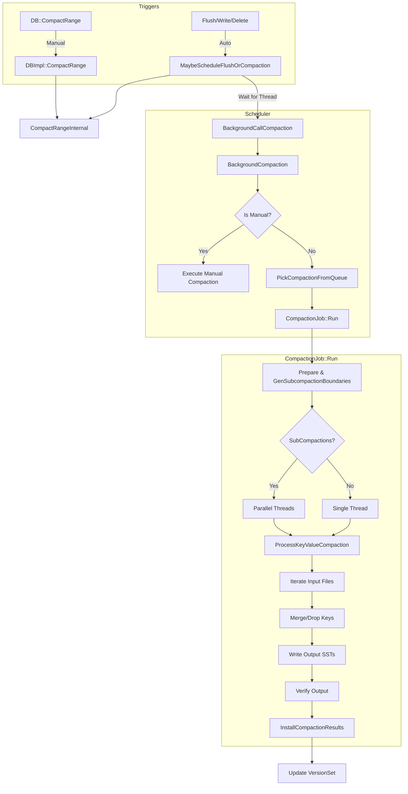

# RocksDB Compaction Flow

This document details the compaction process in RocksDB, covering how compactions are scheduled (auto vs manual) and executed.

## Detailed Steps

### 1. Triggers
-   **Auto Trigger (`MaybeScheduleFlushOrCompaction`)**: Checked after every flush, memtable switch, or significant deletion. It checks if the number of running background jobs is below the limit then schedules `BGWorkCompaction` on the thread pool.
-   **Manual Trigger (`CompactRange`)**: User explicitly requests compaction for a key range. It pauses automatic compactions (if exclusive) or runs alongside them.

### 2. Background Thread (`BackgroundCallCompaction`)
The background thread executes the compaction logic:
-   **`BackgroundCompaction`**: The main driver.
-   **`PickCompactionFromQueue`**: Selects the most urgent compaction task based on score (e.g., level saturation).

### 3. Execution (`CompactionJob::Run`)
The core logic runs in `CompactionJob`:
-   **`Prepare`**: Calculates boundaries for sub-compactions if parallelism is enabled.
-   **`ProcessKeyValueCompaction`**:
    -   Creates a merging iterator over all input files.
    -   Iterates through keys.
    -   Applies `CompactionFilter`.
    -   Drops deleted/overwritten keys (if safe with respect to snapshots).
    -   Writes valid keys to new SST files.
-   **`Install`**: Atomically updates the `VersionSet` to replace input files with the newly written output files.
