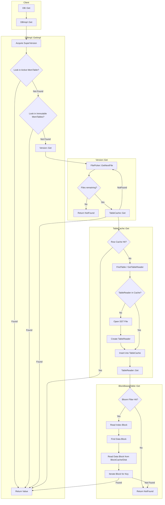

# RocksDB Detailed Read Path Flow

This document outlines the detailed flow of a read operation in RocksDB (`DB::Get`), tracing the path from the API call down to retrieving data from MemTables or SST files.

## Detailed Steps

### 1. `DBImpl::Get`
The entry point. It acquires a `SuperVersion`, which holds the current view of the database (Active MemTable, Immutable MemTables, and Version).

### 2. MemTable Lookup (`GetImpl`)
-   **Active MemTable**: Checks the mutable MemTable where new writes are landing.
-   **Immutable MemTables**: Checks the list of sealed MemTables waiting to be flushed.
-   If found in either, the value is returned immediately (`MEMTABLE_HIT`).

### 3. Version Lookup (`Version::Get`)
If not found in MemTables, the read proceeds to the disk-based levels managed by `Version`.
-   **FilePicker**: Iterates through levels (L0, L1, ...) and selects files that might contain the key based on key ranges.
    -   **L0**: May check multiple overlapping files.
    -   **L1+**: Only checks one file per level (since they are sorted and non-overlapping).

### 4. TableCache Lookup (`TableCache::Get`)
For each candidate SST file:
-   **Row Cache**: Checks if the specific row is cached (if enabled).
-   **TableReader**: retrieves the `TableReader` for the SST file from the `TableCache`. If not present, it opens the file and creates a new reader.

### 5. BlockBasedTable Lookup
Inside the `TableReader`:
-   **Bloom Filter**: Checks if the key *might* exist in the file. fast negative check.
-   **Index Block**: Binary searches the Index Block to find the data block that would contain the key.
-   **Block Cache**: Tries to find the Data Block in `BlockCache`.
-   **Disk Read**: If not in cache, reads the Data Block from disk.
-   **Search**: Binary searches within the Data Block to find the exact key.
